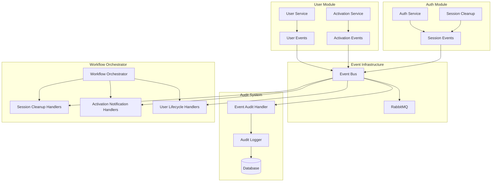

# Event-Driven Workflows

This document describes the event-driven workflows implemented in the Go Templ Template application. These workflows provide automated responses to domain events, ensuring data consistency and implementing complex business processes across modules.

## Overview

The event-driven architecture consists of:

1. **User Activation Workflow** - Manages user account activation via events
2. **Session Cleanup Workflow** - Automatically cleans up sessions based on user events
3. **Event-Based Audit Trail** - Comprehensive audit logging for all domain events
4. **Cross-Module Event Handling** - Coordination between different modules

## Architecture



## User Activation Workflow

### Events

#### UserActivationRequestedEvent
Triggered when an activation is requested for a user.

```go
type UserActivationRequestedEvent struct {
    UserID          string
    Email           string
    ActivationToken string
    ExpiresAt       time.Time
    RequestedBy     string
}
```

#### UserActivatedEvent
Triggered when a user is successfully activated.

```go
type UserActivatedEvent struct {
    UserID      string
    Email       string
    ActivatedAt time.Time
    ActivatedBy string
    Method      string // "token", "admin", "auto"
}
```

#### UserDeactivatedEvent
Triggered when a user is deactivated.

```go
type UserDeactivatedEvent struct {
    UserID        string
    Email         string
    DeactivatedAt time.Time
    DeactivatedBy string
    Reason        string
}
```

#### UserActivationTokenExpiredEvent
Triggered when an activation token expires.

```go
type UserActivationTokenExpiredEvent struct {
    UserID          string
    Email           string
    ActivationToken string
    ExpiredAt       time.Time
}
```

### Workflow Process

1. **Activation Request**
   - Admin or system requests user activation
   - `UserActivationRequestedEvent` is published
   - Activation token is generated and stored
   - Notification handlers can send emails or alerts

2. **Token Usage**
   - User uses activation token
   - Token validity is checked (not expired, not used)
   - User status is changed to active
   - `UserActivatedEvent` is published
   - Token is marked as used

3. **Token Expiration**
   - Expired tokens trigger `UserActivationTokenExpiredEvent`
   - Cleanup handlers remove expired tokens
   - Audit trail records the expiration

### Usage Example

```go
// Request activation
requestCmd := &application.RequestActivationCommand{
    UserID:      "user-123",
    RequestedBy: "admin-456",
}

token, err := activationService.RequestActivation(ctx, requestCmd)
if err != nil {
    return err
}

// Activate user
activateCmd := &application.ActivateUserCommand{
    Token:       token.Token,
    ActivatedBy: "admin-456",
}

user, err := activationService.ActivateUser(ctx, activateCmd)
if err != nil {
    return err
}
```

## Session Cleanup Workflow

### Purpose
Automatically clean up user sessions when user status changes or user is deleted, ensuring security and data consistency.

### Handlers

#### UserStatusChangedSessionCleanupHandler
Cleans up sessions when user status changes to inactive or suspended.

#### UserDeletedSessionCleanupHandler
Cleans up all sessions when a user is deleted.

#### UserDeactivatedSessionCleanupHandler
Cleans up sessions when a user is explicitly deactivated.

### Workflow Process

1. **User Status Change**
   - User status changes to inactive/suspended
   - `UserStatusChangedEvent` is published
   - Session cleanup handler receives event
   - All user sessions are deleted
   - Audit event is logged

2. **User Deletion**
   - User is deleted from system
   - `UserDeletedEvent` is published
   - Session cleanup handler receives event
   - All user sessions are deleted
   - Audit event is logged

3. **User Deactivation**
   - User is explicitly deactivated
   - `UserDeactivatedEvent` is published
   - Session cleanup handler receives event
   - All user sessions are deleted
   - Audit event is logged

### Configuration

```go
type WorkflowConfig struct {
    EnableSessionCleanup  bool
    SessionCleanupTimeout time.Duration
}
```

## Event-Based Audit Trail

### Purpose
Provide comprehensive audit logging for all domain events, creating a complete trail of system activities.

### Components

#### EventAuditHandler
Universal handler that processes all domain events and creates audit trail entries.

#### AuditTrailService
High-level service for managing audit trail functionality.

### Event Mapping

The audit system maps domain events to audit actions:

```go
// User events
"user.created" -> "user_created"
"user.updated" -> "user_updated"
"user.deleted" -> "user_deleted"
"user.activated" -> "user_activated"
"user.deactivated" -> "user_deactivated"

// Auth events
"auth.user_logged_in" -> "user_logged_in"
"auth.user_logged_out" -> "user_logged_out"
"auth.session_expired" -> "session_expired"
```

### Audit Event Structure

```go
type AuditEvent struct {
    EventID       string
    EventType     string
    AggregateID   string
    AggregateType string
    UserID        string
    Action        string
    Resource      string
    ResourceID    string
    Details       map[string]interface{}
    OccurredAt    time.Time
    Metadata      events.EventMetadata
}
```

### Usage Example

```go
// Initialize audit trail service
auditTrailService := audit.NewAuditTrailService(auditLogger, eventBus, logger)

// Register audit handlers for all events
err := auditTrailService.RegisterAuditHandlers(ctx)

// Query audit trail
filter := &audit.AuditFilter{
    UserID: "user-123",
    Limit:  10,
}

auditEvents, err := auditTrailService.GetAuditTrail(ctx, filter)
```

## Workflow Orchestrator

### Purpose
Central coordinator for all event-driven workflows, managing handler registration and configuration.

### Features

- **Handler Registration**: Automatically registers all workflow handlers
- **Configuration Management**: Centralized workflow configuration
- **Health Monitoring**: Monitors workflow health and status
- **Graceful Shutdown**: Properly shuts down all workflows

### Initialization

```go
// Create orchestrator
orchestrator := workflows.NewEventWorkflowOrchestrator(
    eventBus,
    auditTrailService,
    userService,
    authService,
    activationService,
    sessionRepo,
    logger,
    config,
)

// Initialize all workflows
err := orchestrator.Initialize(ctx)
if err != nil {
    log.Fatalf("Failed to initialize workflows: %v", err)
}
```

### Configuration

```go
type WorkflowConfig struct {
    // Session cleanup settings
    EnableSessionCleanup     bool
    SessionCleanupTimeout    time.Duration
    
    // Audit trail settings
    EnableAuditTrail         bool
    AuditAllEvents          bool
    AuditEventTypes         []string
    
    // Activation workflow settings
    ActivationTokenDuration  time.Duration
    EnableAutoActivation     bool
    
    // Retry settings
    MaxRetries              int
    RetryDelay              time.Duration
}
```

## Testing

### Unit Tests
Located in `tests/unit/event_workflows_test.go`:
- Event creation and validation
- Handler logic testing
- Command validation
- Mock-based testing

### Integration Tests
Located in `tests/integration/event_flow_test.go`:
- End-to-end workflow testing
- Event bus integration
- Database integration
- Cross-module coordination

### Test Coverage

The tests cover:
- User registration and activation flow
- Session cleanup workflows
- Audit trail functionality
- Token expiration handling
- Error scenarios and edge cases

## Monitoring and Observability

### Health Checks

```go
status, err := orchestrator.GetWorkflowStatus(ctx)
// Returns:
// - Event bus health
// - Audit trail status
// - Session cleanup status
// - Activation workflow status
```

### Metrics

Key metrics to monitor:
- Event processing latency
- Event processing success/failure rates
- Session cleanup frequency
- Activation token usage rates
- Audit event volume

### Logging

All workflows use structured logging with:
- Event IDs for traceability
- User IDs for user-specific actions
- Error details for debugging
- Performance metrics

## Best Practices

### Event Design
1. **Immutable Events**: Events should be immutable once created
2. **Rich Context**: Include sufficient context in event data
3. **Versioning**: Version events for backward compatibility
4. **Idempotency**: Handlers should be idempotent

### Error Handling
1. **Graceful Degradation**: Workflows should continue even if some handlers fail
2. **Retry Logic**: Implement retry mechanisms for transient failures
3. **Dead Letter Queues**: Handle permanently failed events
4. **Circuit Breakers**: Prevent cascade failures

### Performance
1. **Async Processing**: Process events asynchronously when possible
2. **Batching**: Batch related operations for efficiency
3. **Caching**: Cache frequently accessed data
4. **Monitoring**: Monitor performance metrics

### Security
1. **Event Validation**: Validate all incoming events
2. **Authorization**: Check permissions for event handlers
3. **Audit Logging**: Log all security-relevant events
4. **Data Protection**: Protect sensitive data in events

## Troubleshooting

### Common Issues

1. **Events Not Processing**
   - Check event bus connectivity
   - Verify handler registration
   - Check event serialization

2. **Session Cleanup Not Working**
   - Verify handler subscription
   - Check user status change events
   - Verify database connectivity

3. **Audit Trail Missing Events**
   - Check audit handler registration
   - Verify database permissions
   - Check event filtering

4. **Activation Tokens Not Working**
   - Check token expiration
   - Verify token generation
   - Check database constraints

### Debugging

1. **Enable Debug Logging**: Set log level to debug for detailed information
2. **Check Event Bus**: Verify RabbitMQ connectivity and queues
3. **Database Queries**: Check audit and activation token tables
4. **Handler Status**: Verify all handlers are registered and active

## Future Enhancements

### Planned Features
1. **Workflow Visualization**: Dashboard for monitoring workflows
2. **Event Replay**: Ability to replay events for debugging
3. **Advanced Filtering**: More sophisticated audit trail filtering
4. **Workflow Templates**: Reusable workflow patterns
5. **Performance Optimization**: Caching and batching improvements

### Extension Points
1. **Custom Handlers**: Easy addition of new event handlers
2. **External Integrations**: Webhooks and external system notifications
3. **Workflow Rules**: Configurable business rules
4. **Event Transformations**: Event data transformation pipelines